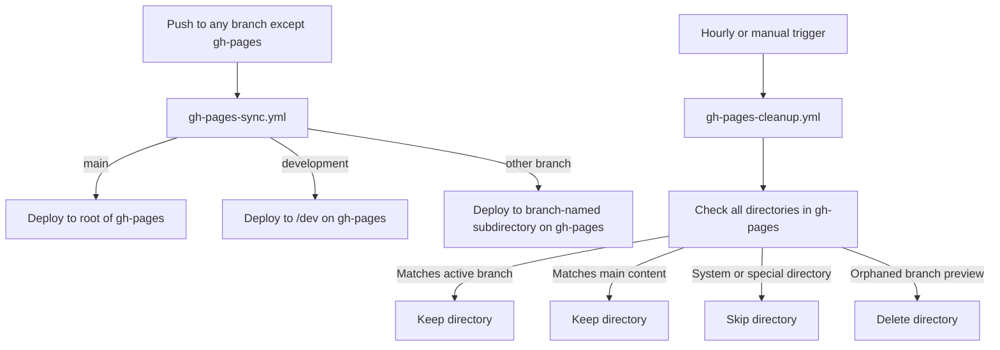
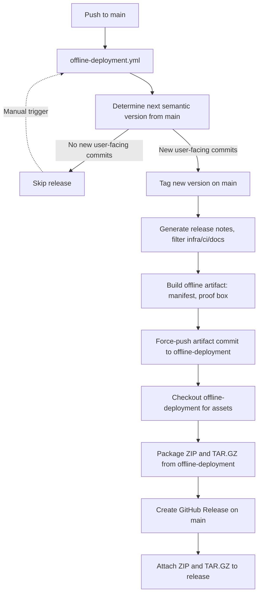

# GitHub Actions Workflows: Multi-Branch Deployment, Offline Build, and Automated Release

This repository uses a unified GitHub Actions workflow to automate branch preview deployments, maintain a clean GitHub Pages environment, generate cryptographically verifiable offline builds, and manage semantic versioned releases with downloadable artifacts.

---

## Table of Contents

1. [Overview](#overview)
2. [Branch Preview and Cleanup](#branch-preview-and-cleanup)
   - [Branch Sync Workflow](#branch-sync-workflow)
   - [Cleanup Workflow](#cleanup-workflow)
3. [Offline Deployment, Tagging, and Release](#offline-deployment-tagging-and-release)
4. [File Locations](#file-locations)
5. [How to Download the Latest Offline Build](#how-to-download-the-latest-offline-build)
6. [Best Practices and Notes](#best-practices-and-notes)
7. [Troubleshooting](#troubleshooting)

---

## Overview

This repository is designed for robust, automated, and auditable deployment and release management. The workflows are structured as follows:

- **`gh-pages-sync.yml`**  
  Deploys any branch (except `gh-pages`) to a unique subdirectory on the `gh-pages` branch, enabling live previews for every branch.
- **`gh-pages-cleanup.yml`**  
  Periodically removes orphaned branch preview directories from `gh-pages` to keep the deployment environment clean and up-to-date.
- **`offline-deployment.yml`**  
  A single workflow that:
  - Determines the next semantic version and release notes from `main` using [Conventional Commits](https://www.conventionalcommits.org/en/v1.0.0/)
  - Tags the release on `main`
  - Builds and pushes a cryptographically verifiable, exam-proof offline build (with manifest and proof box) to the `offline-deployment` branch
  - Packages the offline build as ZIP and TAR.GZ
  - Publishes a GitHub Release with the correct tag, release notes, and attached artifacts

---

## Branch Preview and Cleanup

### Branch Sync Workflow

**File:** `.github/workflows/gh-pages-sync.yml`

- **Triggers:**  
  - On push to any branch (except `gh-pages`)
  - Manually via the Actions tab

- **Logic:**  
  - The `main` branch is deployed to the root of `gh-pages`.
  - The `development` branch is deployed to `/dev`.
  - All other branches are deployed to a subdirectory named after the branch (slashes replaced by dashes).
  - No build step is required; static content is deployed as-is.
  - Each deployment logs the branch, deployment path, and resulting URL for traceability.

- **Purpose:**  
  Enables live previews for all active branches, supporting feature development, QA, and stakeholder review.

---

### Cleanup Workflow

**File:** `.github/workflows/gh-pages-cleanup.yml`

- **Triggers:**  
  - Every hour (configurable via cron)
  - Manually via the Actions tab

- **Logic:**  
  - Checks out both `gh-pages` and `main` (as `.main-branch`).
  - Builds a list of active branch deployment directories.
  - For each directory in the root of `gh-pages`:
    - **Keeps** if present in `main` (main branch content).
    - **Keeps** if an active branch deployment directory.
    - **Skips** system/special directories (e.g., `.git`, `.github`, `.main-branch`).
    - **Deletes** if an orphaned branch deployment directory (not in `main`, not an active branch).
  - Logs every action for auditability.
  - Commits and pushes if any deletions occur.

- **Purpose:**  
  Maintains a clean and accurate preview environment, ensuring only active branches are represented on GitHub Pages.

---

## Offline Deployment, Tagging, and Release

**File:** `.github/workflows/offline-deployment.yml`

- **Triggers:**  
  - On push to `main`
  - Manually via the Actions tab

- **Logic:**  
  1. **Semantic Versioning and Tagging:**
     - Determines the next semantic version (major, minor, or patch) based on commit messages since the last tag, following [Conventional Commits](https://www.conventionalcommits.org/en/v1.0.0/).
     - Excludes from release notes:
       - Commits starting with `ci:`, `chore:`, or `docs:`
       - Commits that only touch `.yml`, `.yaml`, or `.md` files
     - Groups release notes by type: Features, Fixes, Other changes.
     - Tags the release on `main` if there are new user-facing commits.
  2. **Offline Artifact Build:**
     - Checks out the latest `main` and creates a new artifact commit with the manifest and proof box injected.
     - Force-pushes this artifact commit to the `offline-deployment` branch.
  3. **Packaging and Release:**
     - Checks out the latest `offline-deployment` branch.
     - Packages the offline build as both ZIP and TAR.GZ, named with the version tag.
     - Publishes a GitHub Release with the correct tag, release notes, and attached artifacts.

- **Result:**  
  Every user-facing change to `main` produces a new, versioned GitHub Release with:
    - Semantic version tag (e.g., `v1.2.3`)
    - Context-rich, grouped release notes (excluding infra-only changes)
    - Downloadable ZIP and TAR.GZ of the offline build (from `offline-deployment`)
    - A cryptographically verifiable, exam-proof offline build

---

## File Locations

- **Branch Preview Sync:**  
  `.github/workflows/gh-pages-sync.yml`
- **Branch Preview Cleanup:**  
  `.github/workflows/gh-pages-cleanup.yml`
- **Offline Deployment, Tagging, and Release:**  
  `.github/workflows/offline-deployment.yml`

---

## How to Download the Latest Offline Build

1. Go to the [Releases page](https://github.com/jaduruch/elecalculate/releases).
2. Download the latest `elecalculate-offline-vX.Y.Z.zip` or `elecalculate-offline-vX.Y.Z.tar.gz` from the most recent release.

---

## Best Practices and Notes

- **Proof Box Placement:**  
  The proof box is injected directly before the main content for maximum visibility and auditability.
- **No Main CSS Changes:**  
  All proof box styles are inline and do not affect the rest of the site.
- **Release Artifacts:**  
  Each release includes both a ZIP and TAR.GZ for easy offline distribution and archival.
- **Semantic Versioning:**  
  Releases are versioned and documented automatically based on commit messages, following the [Conventional Commits](https://www.conventionalcommits.org/en/v1.0.0/) standard.
- **Release Notes Filtering:**  
  Release notes exclude infrastructure-only changes and are grouped by type for clarity.
- **Auditability:**  
  The manifest hash and build date are always visible in the proof box and as a comment in the HTML, supporting compliance and verification requirements.
- **Clean Artifacts:**  
  All archives are created from a clean `dist/` directory to avoid CI/CD temp file issues and ensure reproducibility.
- **Workflow File Presence:**  
  Ensure all workflow files are present in the relevant branches (`main`, `offline-deployment`, etc.) to guarantee correct triggering and operation.

---

## Troubleshooting

- **Release not created:**  
  Ensure there are new user-facing commits on `main` since the last tag.
- **Artifacts missing:**  
  Check the Actions logs for the archive creation and upload steps. Ensure the `dist/` directory is used for clean archiving.
- **Proof box not visible:**  
  Confirm the deployment workflow ran and injected the proof box before the main content.
- **Workflow not triggering:**  
  Ensure the workflow file is present in the branch at the time of the push, and that the push is not a re-push of the same commit SHA.
- **Tag or release issues:**  
  Tags are created and pushed by the release workflow. If tags are missing or incorrect, check the versioning logic and ensure no manual tags are interfering.
- **Force-push issues:**  
  If using force-push for the artifact branch, ensure the workflow file is present in the branch after the push. If not, the workflow will not trigger.
